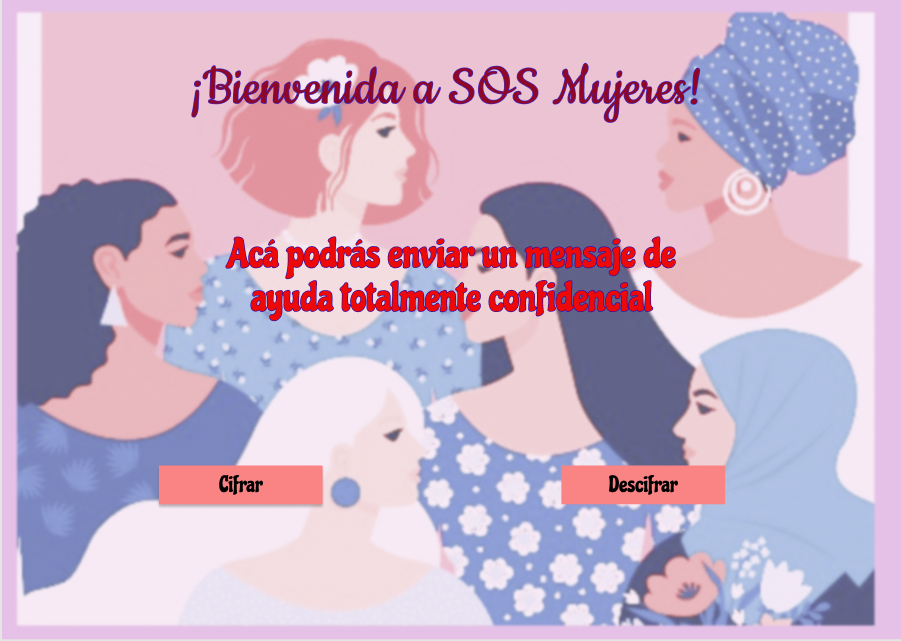
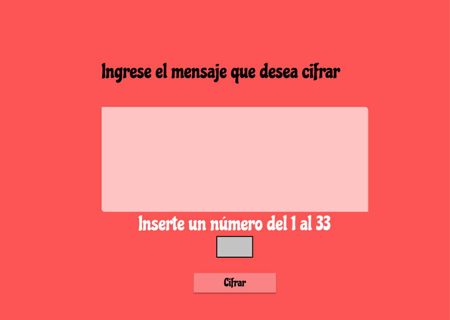
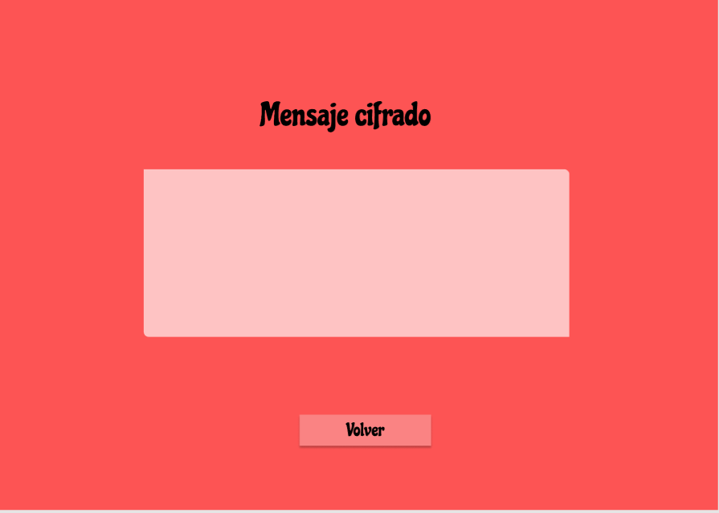
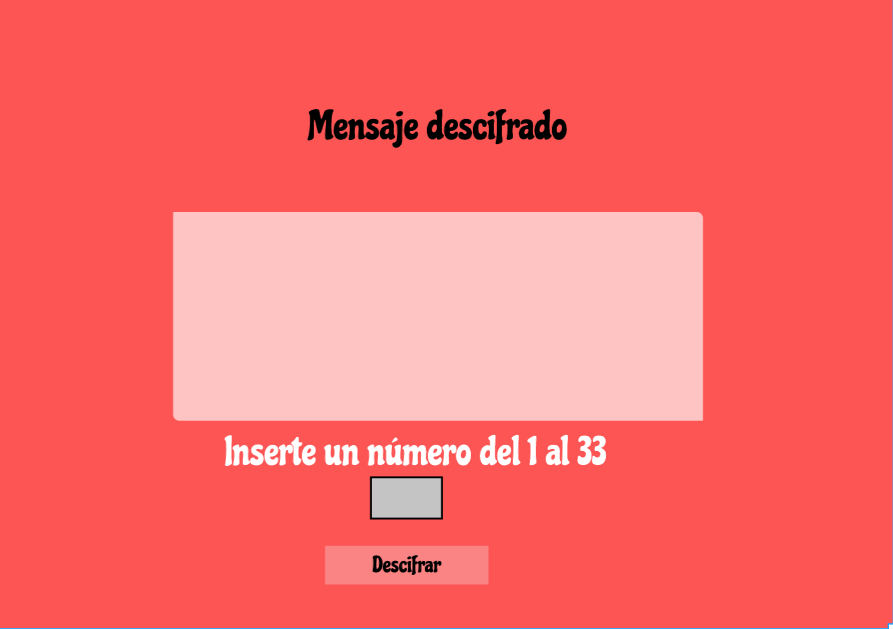
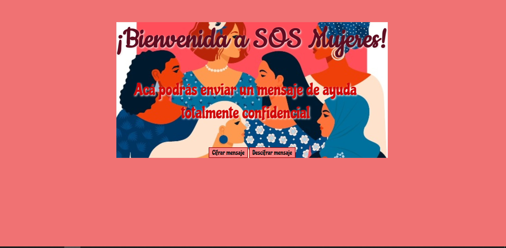
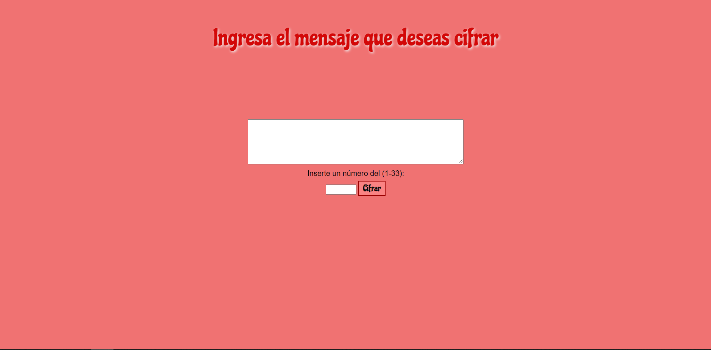
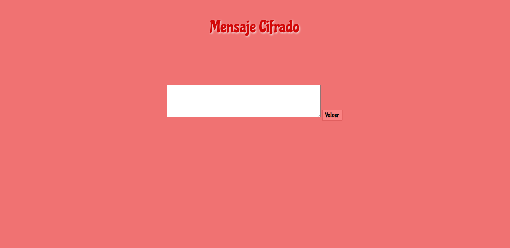
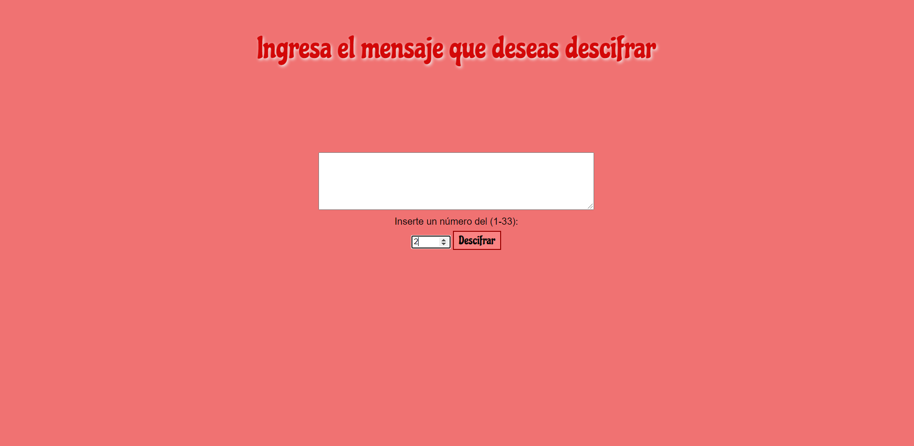
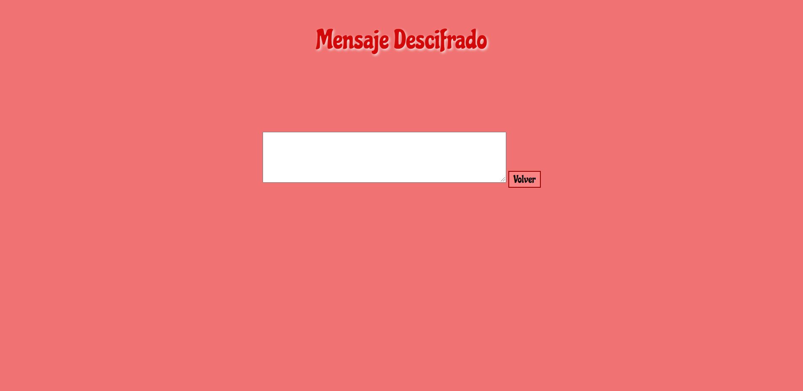

# Cifrado César

# Proyecto Cifrado César: SOS Mujeres

Este proyecto tiene como título: "SOS Mujeres", es una aplicación diseñada para las mujeres que sufren de violencia doméstica: física, verbal o psicológica; para que tengan un espacio seguro, en el cual puedan enviar un mensaje cifrado de forma confidencial para solicitar ayuda.

Esta aplicación puede ser usada por mujeres sin límites de edad, y de esa forma recibir ayuda a su problema. Puede usarse de forma rápida y segura, y su mensaje quedará cifrado y/o descifrado de acuerdo a la elección de la usuaria.

El primer prototipo que realicé para el proyecto fue hecho en papel, y quedó de la siguiente forma:

Luego realicé el prototipo en Figma de la siguiente manera:

Para ser usado, la usuaria debe elegir la opción Cifrar y/o Descifrar, escribir el mensaje que desea, en este caso solo se admite letras; luego selecciona la opción Cifrar y/o Descifrar y aparecerá el mensaje con la función elegida. 

La versión final del proyecto realizado, quedó de la siguiente manera:

